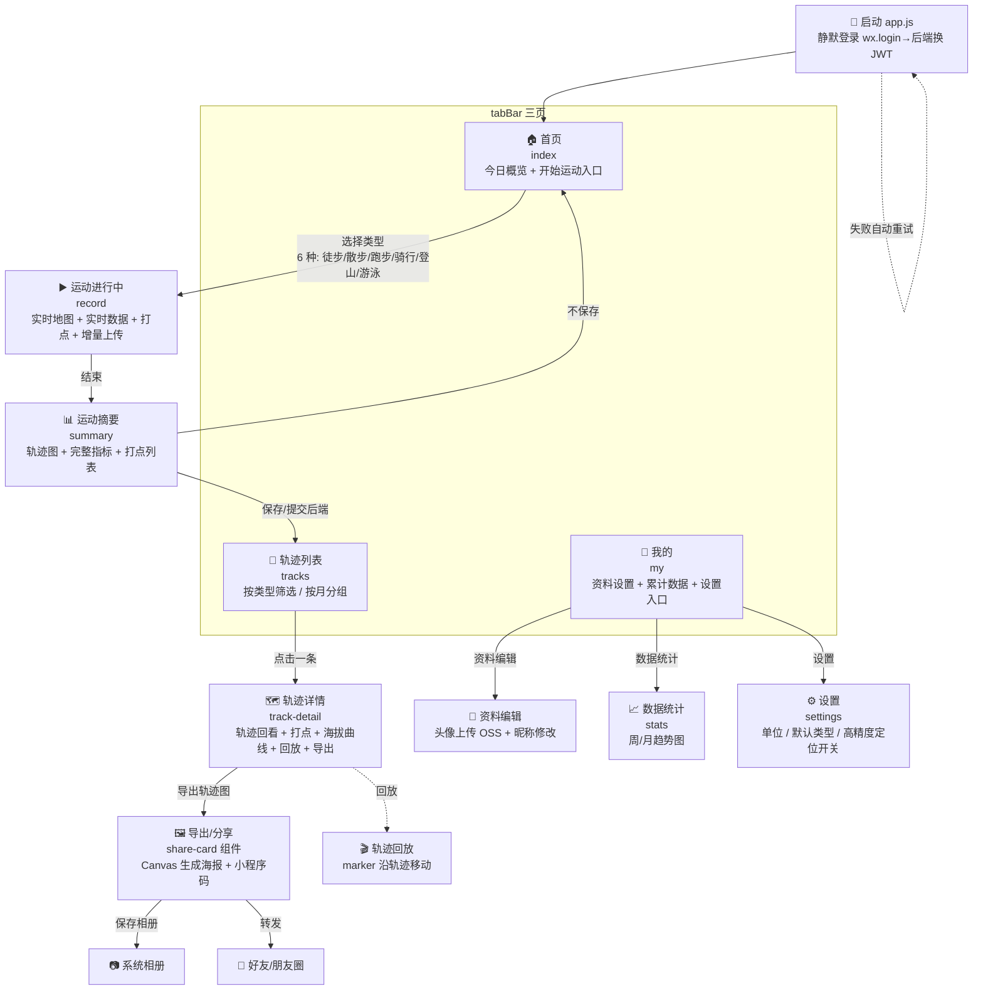
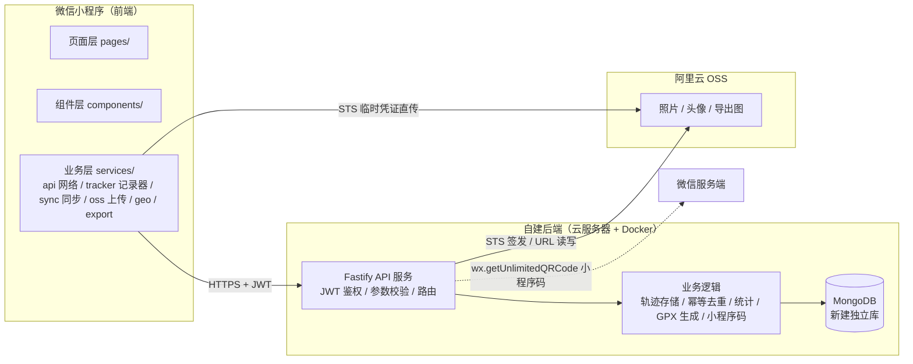
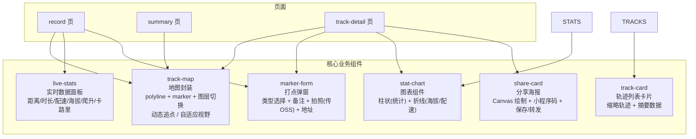
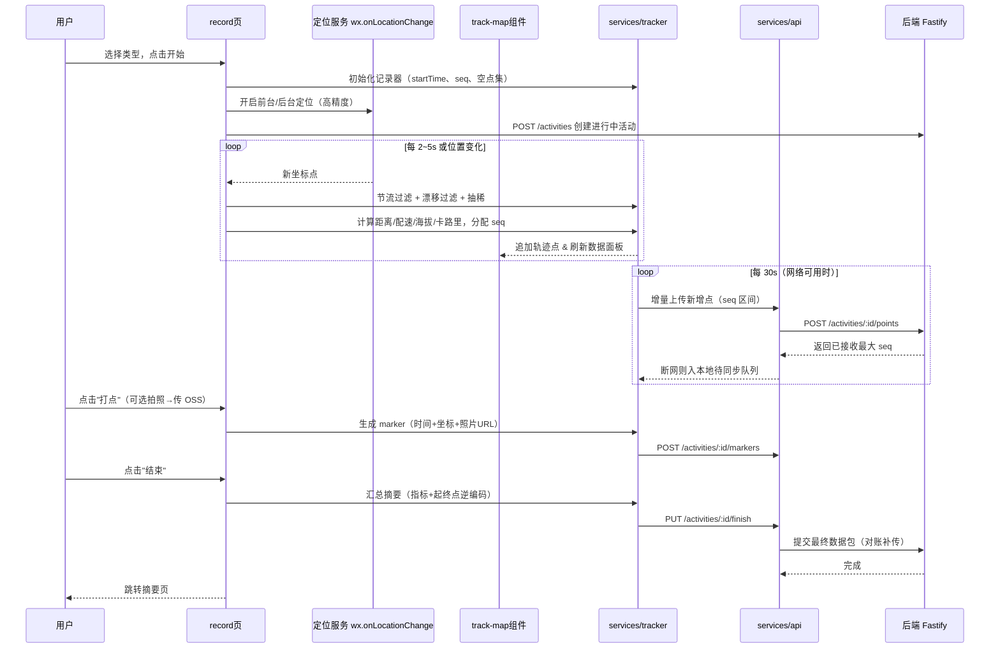

# 运动轨迹记录小程序 — 前端页面架构

> 版本：v0.2（已确认决策，2025-08-10）
> 对应需求：docs/01-需求说明书.md
> 后端设计：docs/04-后端架构.md

---

## 1. 全局结构（app.json）

```
tabBar（3 个）：
  首页 pages/index/index             🏠 开始运动
  轨迹 pages/tracks/tracks          📍 历史轨迹
  我的 pages/my/my                  👤 个人中心

其他页面：record（运动进行中）、summary（运动摘要）、track-detail（轨迹详情）、
          stats（数据统计）、profile（资料编辑）、settings（设置）
```

## 2. 页面架构图（Mermaid）

### 2.1 页面流转图



### 2.2 前后端交互架构图



### 2.3 组件结构图



### 2.4 数据流（以"记录一次运动"为例）



---

## 3. 页面明细

### 3.1 首页 `pages/index/index`
- **布局**：顶部欢迎语/今日天气可选 → 大卡片"开始运动"（六种运动类型选择）→ 今日/本周概览卡片
- **组件**：`t-cell`、`t-radio-group`（类型选择）、`t-button`
- **逻辑**：类型选择 → `wx.navigateTo` 到 record 页；类型列表从 `config/activity-types.js` 读取（6 种）

### 3.2 运动进行中 `pages/record/record`
- **布局**：全屏地图（track-map 组件，含图层切换按钮）→ 底部悬浮实时数据面板（live-stats）→ 打点按钮 / 暂停 / 结束按钮
- **关键点**：
  - `wx.setKeepScreenOn(true)` 保持常亮
  - 打点按钮运动中可随时点，弹出 marker-form；照片先传 OSS 拿 URL
  - 结束需二次确认；结束前自动补一次"终点打点"
  - 增量上传由 `services/sync.js` 调度（每 30s），断网入待同步队列
- **组件**：track-map、live-stats、marker-form、`t-button`、`t-dialog`（确认）、`t-icon`

### 3.3 运动摘要 `pages/summary/summary`
- **布局**：轨迹图卡片（track-map 静态展示，自适应视野）→ 指标网格（距离/时长/配速/爬升/卡路里）→ 打点时间线列表 → 操作（保存/放弃）
- **逻辑**：数据由 record 页通过事件通道传入或暂存全局；保存触发 `finish` 提交 + 对账补传，成功后跳轨迹列表

### 3.4 轨迹列表 `pages/tracks/tracks`
- **布局**：筛选 tab（全部/徒步/散步/跑步/骑行/登山/游泳）→ 按月分组列表（track-card 卡片）
- **逻辑**：服务端分页拉取（`GET /activities`）；下拉刷新、触底加载更多；待同步角标提示

### 3.5 轨迹详情 `pages/track-detail/track-detail`
- **布局**：地图（完整轨迹 + 打点 markers + 图层切换）→ 数据指标 → 海拔/配速曲线（stat-chart 折线）→ 打点时间线（点击定位到地图）→ 底部操作栏（导出图片 / 回放 / 删除）
- **逻辑**：`trackId` 从列表页传入，`GET /activities/:id` 拉详情；导出调 share-card 组件

### 3.6 数据统计 `pages/stats/stats`
- **布局**：顶部累计概览（总距离/总时长/总次数/总爬升）→ 周期选择（周/月）→ stat-chart 柱状趋势图
- **逻辑**：基于服务端已完成活动聚合（`GET /stats` 或本地聚合），下拉刷新

### 3.7 我的 `pages/my/my`
- **布局**：头像昵称（默认取微信授权，点击进入资料编辑）→ 累计数据入口 → 菜单列表（数据统计 / 设置 / 关于）
- **逻辑**：资料编辑支持修改昵称、`wx.chooseMedia` 选头像 → 传 OSS → `PUT /users/me`
- **组件**：`t-cell-group`、`t-avatar`、`t-dialog`

### 3.8 资料编辑 `pages/profile/profile`
- **布局**：头像（点击更换）、昵称输入、性别可选、保存
- **逻辑**：头像经 OSS 直传后提交 URL；保存后刷新全局用户态

### 3.9 设置 `pages/settings/settings`
- **布局**：单位切换（公制/英制）、默认运动类型、高精度定位开关、后台定位说明、隐私政策、关于
- **组件**：`t-cell`、`t-switch`、`t-radio-group`

---

## 4. 核心组件规格

| 组件 | 职责 | 对外接口（props/events） | 备注 |
|---|---|---|---|
| **track-map** | 地图渲染封装：polyline 绘制、打点 marker、视野控制、动态追点、图层切换 | props: `points, markers, followMode, mapType`; methods: `fitView()`, `addPoint()`, `switchLayer()` | 内部封装 `wx.createMapContext`；抽稀逻辑在外部 service 做 |
| **live-stats** | 实时数据面板 | props: `distance, duration, pace, altitude, climb, calories` | 数值动画可选；海拔为 null 时隐藏 |
| **marker-form** | 打点弹窗 | props: `visible, position(经纬度), address`; events: `confirm(markerData)`, `cancel` | 含拍照（`wx.chooseMedia` → OSS 上传） |
| **track-card** | 轨迹列表卡片 | props: `activity`; events: `tap` | 缩略图可用静态 map 快照 |
| **stat-chart** | 图表（柱状 + 折线） | props: `data[], type(bar|line), unit` | 轻量 Canvas 自绘，支持选中态 |
| **share-card** | 分享海报生成 | props: `activity, points, markers`; events: `saved` | Canvas 2D 绘制 → `canvasToTempFilePath` → 保存/转发；叠加小程序码 |

---

## 5. 分层架构（目录规划）

```
miniprogram/
├── app.js / app.json / app.wxss      # 全局（静默登录初始化、tdesign 主题变量、tabBar 配置）
├── pages/
│   ├── index/                        # 首页
│   ├── record/                       # 运动进行中
│   ├── summary/                      # 运动摘要
│   ├── tracks/                       # 轨迹列表
│   ├── track-detail/                 # 轨迹详情
│   ├── stats/                        # 数据统计
│   ├── my/                           # 我的
│   ├── profile/                      # 资料编辑
│   └── settings/                     # 设置
├── components/
│   ├── track-map/                    # 地图封装（含图层切换）
│   ├── live-stats/                   # 实时数据
│   ├── marker-form/                  # 打点弹窗
│   ├── track-card/                   # 轨迹卡片
│   ├── stat-chart/                   # 图表（柱状 + 折线）
│   └── share-card/                   # 分享海报
├── services/                         # 业务逻辑层（与 UI 解耦）
│   ├── api.js                        # 网络层：请求封装 + JWT 注入 + 401 静默刷新
│   ├── tracker.js                    # 运动记录器：采点/节流/漂移过滤/抽稀/指标计算/seq 分配
│   ├── sync.js                       # 增量上传调度 + 断网待同步队列 + 补传对账
│   ├── storage.js                    # 本地缓存（用户态、待同步队列、设置）
│   ├── stats.js                      # 统计聚合
│   ├── geo.js                        # QQMapWX 封装（逆地理编码等）
│   ├── oss.js                        # OSS 上传（STS 凭证获取 + 直传）
│   └── export.js                     # 轨迹导出（图片 Canvas / GPX 生成）
├── utils/                            # 通用工具（格式化、常量）
└── config/                           # 腾讯地图 key、运动类型配置（6 种 + MET 系数）、打点类型常量、API 地址
```

> 设计原则：**services 层与 UI 解耦**，轨迹计算逻辑（距离、配速、抽稀）纯函数化；`api.js` 统一鉴权与请求，`sync.js` 统一增量上传与离线补传，页面不直接碰网络。

---

## 6. 关键技术决策说明

1. **地图组件**：直接使用微信原生 `map` 组件（`polyline` + `marker`），不引入腾讯地图 web 版 SDK 重绘，性能与体验最佳；QQMapWX 仅用于逆地理编码、POI 等数据服务。
2. **定位**：`wx.onLocationChange` 频率由系统决定（实测亮屏约 2s 一次），必须自行做**时间/距离双阈值节流**，防止点位冗余与电量浪费；高精度定位（`isHighAccuracy`）采集海拔，设置里可关闭。
3. **轨迹抽稀**：保存前与展示前用 Douglas-Peucker 抽稀，控制地图 polyline 点数（≤ 5000 点），保证流畅。
4. **数据同步（增量 + 补传）**：运动中每 30s 批量增量上传轨迹点（带 seq），服务端幂等去重；断网时入本地待同步队列，恢复后自动补传；结束后提交 final 包对账。
5. **鉴权**：app 启动时 `wx.login` → 后端换 JWT，`api.js` 统一注入 `Authorization` 头，401 时静默刷新 token 重试。
6. **文件上传**：照片/头像通过后端 STS 临时凭证直传阿里云 OSS，前端不持有长期密钥；展示时直接使用 OSS URL。
7. **导出图**：Canvas 2D 绘制轨迹图（含打点 icon、数据文字、可选背景样式），再 `wx.canvasToTempFilePath` 保存相册或作为分享海报底图；海报叠加小程序码（后端调 `wx.getUnlimitedQRCode` 生成）。
