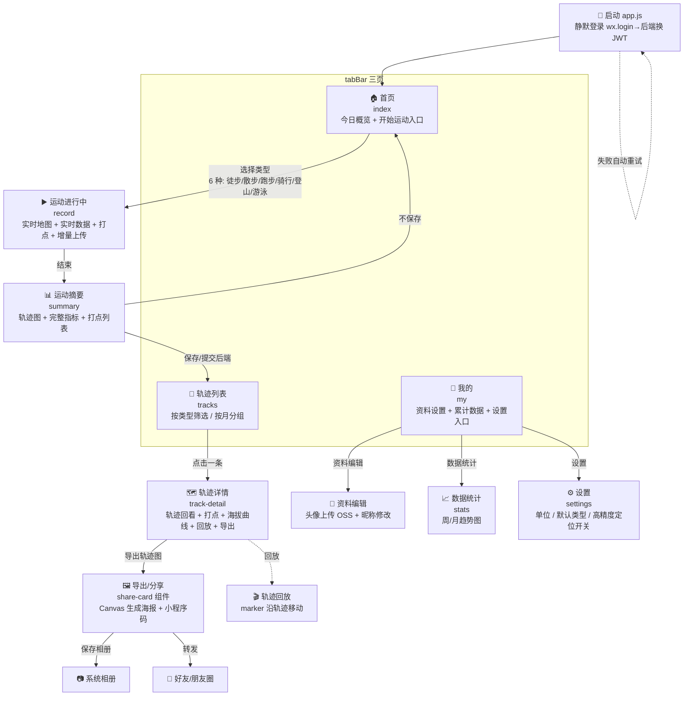
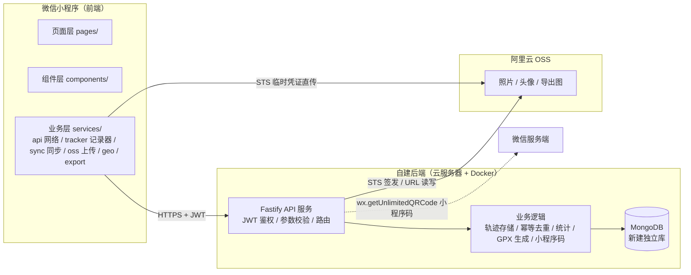
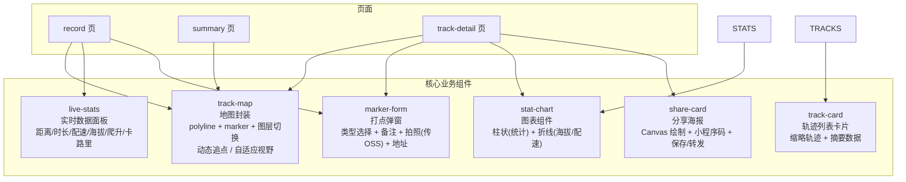
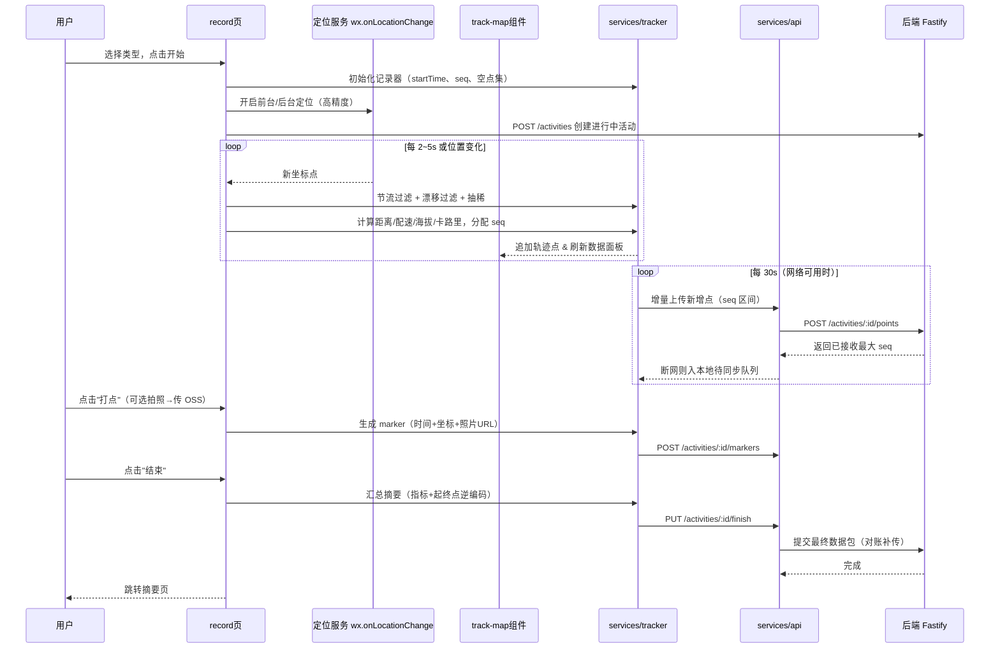

# 运动轨迹记录小程序 — 前端页面架构

> 版本：v0.2（已确认决策，2025-08-10）
> 对应需求：docs/01-需求说明书.md
> 后端设计：docs/04-后端架构.md

---

## 1. 全局结构（app.json）

```
tabBar（3 个）：
  首页 pages/index/index             🏠 开始运动
  轨迹 pages/tracks/tracks          📍 历史轨迹
  我的 pages/my/my                  👤 个人中心

其他页面：record（运动进行中）、summary（运动摘要）、track-detail（轨迹详情）、
          stats（数据统计）、profile（资料编辑）、settings（设置）
```

## 2. 页面架构图（Mermaid）

### 2.1 页面流转图



### 2.2 前后端交互架构图



### 2.3 组件结构图



### 2.4 数据流（以"记录一次运动"为例）



---

## 3. 页面明细

### 3.1 首页 `pages/index/index`
- **布局**：顶部欢迎语/今日天气可选 → 大卡片"开始运动"（六种运动类型选择）→ 今日/本周概览卡片
- **组件**：`t-cell`、`t-radio-group`（类型选择）、`t-button`
- **逻辑**：类型选择 → `wx.navigateTo` 到 record 页；类型列表从 `config/activity-types.js` 读取（6 种）
- **概览区容错（2026-09-23）**：`loadOverview` 的三个接口各兜各的失败——`/stats/overview`（累计数据）、`/stats/footprint`（点亮省市）、`/stats/trend?days=365`（运动日历）。原先三条共用一个 `Promise.all`，overview 一 reject 就把不相关的日历一起拖没，且只剩一句 `console.error`，用户看到的只是「日历不见了」。现在失败会在自己那张卡上留一行「接口名：实际原因」+ 重试（`catchtap`，不触发该卡跳统计页），有旧数据/缓存时保留不清空；三条全绿才写 `indexOverviewCache_v1`（半套数据不落盘，否则下次冷启动会把「接口挂了」掩盖成「你的数据就这些」）。回归 `test/index-overview.test.js` H1~H8。

### 3.2 运动进行中 `pages/record/record`
- **布局**：全屏地图（track-map 组件，含图层切换按钮）→ 底部悬浮实时数据面板（live-stats）→ 打点按钮 / 暂停 / 结束按钮
- **关键点**：
  - `wx.setKeepScreenOn(true)` 保持常亮
  - 打点按钮运动中可随时点，弹出 marker-form；照片先传 OSS 拿 URL
  - 结束需二次确认；结束前自动补一次"终点打点"
  - 增量上传由 `services/sync.js` 调度（每 30s），断网入待同步队列
- **组件**：track-map、live-stats、marker-form、`t-button`、`t-dialog`（确认）、`t-icon`

### 3.3 运动摘要 `pages/summary/summary`
- **布局**：轨迹图卡片（track-map 静态展示，自适应视野）→ 指标网格（距离/时长/配速/爬升/卡路里）→ 打点时间线列表 → 操作（保存/放弃）
- **逻辑**：数据由 record 页通过事件通道传入或暂存全局；保存触发 `finish` 提交 + 对账补传，成功后跳轨迹列表

### 3.4 轨迹列表 `pages/tracks/tracks`
- **布局**：筛选 tab（全部/徒步/散步/跑步/骑行/登山/游泳）→ 按月分组列表（track-card 卡片）
- **逻辑**：服务端分页拉取（`GET /activities`）；下拉刷新、触底加载更多；待同步角标提示

### 3.5 轨迹详情 `pages/track-detail/track-detail`
- **布局**：地图（完整轨迹 + 打点 markers + 图层切换）→ 运动数据（3 列网格：标签在上、大数值 + 小单位在下；运动时长/平均配速/运动消耗/总时长/最快 1km/爬升高度/打点，缺数据的格不占位，时长与爬升高度恒展示）→ 特别成就（本轨迹在所属类型中持有的个人最佳，每行「🏆 成就名 + 成绩」；无纪录则整卡不展示）→ 配速区间（仅跑步：自锚定分档 + 时长/占比）→ 单段明细（每公里）→ 海拔曲线（stat-chart 折线，仅徒步/登山）→ 打点时间线（点击定位到地图）→ 底部操作栏（导出图片 / 回放 / 删除）；开始/结束时间与平均精度同处卡片底部小字行
- **时长口径**：运动时长 = `duration`（扣除暂停）；总时长 = `totalDuration`（墙钟 `endTime − startTime`，含暂停），由服务端 `toActivityDto` 下发（`endTime` 缺失时回退 `duration + pausedMs`），前端仅在接口未返回时按同口径回退
- **逻辑**：`trackId` 从列表页传入，`GET /activities/:id` 拉详情；导出调 share-card 组件
- **配速计算**：`utils/track-pace.js` 为地图着色与配速区间共用——45 秒滑动窗口平滑逐点配速（窗口位移 <5m 视为原地、跨 pauseGap / >60s 断档不回溯）；区间边界 = 本次平均配速 × 0.90/0.97/1.05/1.15/1.30（自锚定，跨水平可比），按移动时间加权的采样时长分档，占比取整后按最大余数法补齐到 100%（`test/track-pace.test.js`）
- **静止剔除（自动暂停，2026-09-24）**：原地不动又没点暂停的时间不再计入运动时长——判定与入库都在服务端 finish 时算一次（见 `docs/04` §5.1），端上只消费结果。详情页单段明细按 `still` 标记跳过该时段（`computeKmSegments` 把 `still` 与 `pauseGap` 同等对待），否则各段用时之和会大于头部的运动时长、数字自相矛盾（`test/track-detail-segments.test.js` 带对照用例）。**实测（回填后的 3h 徒步 `6a9ed90e…`）**：墙钟 3:06:40 里剔掉 1102s（8 段）、运动时长 **2:48:18**、平均配速 20'03" → 18'05"、第 1 公里用时 23:35 → 23:20、单段明细 10 段合计 2:37:19；同一条轨迹在最初 30s/15m 口径下曾剔掉 3281s（63 段）、运动时长被压到 2:11:59 —— 门槛由用户实测反馈「偏大」后收紧为 60s/10m，判据再由二维升级为**三维距离（含高程）**。历史活动由 `sport_track_api/scripts/backfill-standstill.ts` 一次性回填（可重跑：换门槛/换判据后直接再跑一次）。
- **非运动段灰显与录入端提示（2026-09-24）**：服务端判出的疑似乘车段（`vehicle` 点，见 `docs/04` §5.2）在端上**不隐身删除，画成灰色**：`track-map.js` 的 `VEHICLE_COLOR = #c9cdd4` 在配速与海拔两种着色模式下都盖过档位色（`test/track-map-vehicle.test.js` 用同一份点集正反对照：有标记出 1 条灰线、无标记一段灰都不出）；详情页图例末端加一块灰 +「疑似搭车 · 未计入」，数据卡下一行整句「约 1.26 公里疑似搭车，未计入」**由接口下发**（`vehicleNotice`，见 `docs/04` §5.2；2026-09-24 从端上自拼改过来——端上自己拼，后台要显示同一句就得再抄一遍且迟早分叉）。这一行**文字改橙 `#f97316` + 22rpx 中等粗**跳出来（`.legend-note` 与后台 `VEHICLE_NOTICE_COLOR` 同值，由 `scripts/tmp-pace-equiv.ts` 核；实测 17.59px 高一行装下。中途试过「灰字 + 淡黄底色块」，用户反馈观感怪，回到改文字色）。单段明细**外观不变**，但 `computeKmSegments` 把 `vehicle` 与 `pauseGap` 同等对待——不剔就会头上写 4.67km、明细加起来 5.9km。**实测（dev 造数 `6ab4bb00…`：跑→搭车 90s→停 48s→又搭车 90s→跑）**：地图 5 段线里 2 段灰（各 46 点），头部 3.00km / 运动 20:48 / 总 23:48，明细 3 段合计 3.00km、1248s 与头部完全一致。录入端另给实时提示：`utils/vehicle-live.js`（阈值与服务端同口径，端上 import 不到后端代码，**改一处要改两处**）由 tracker 逐步喂点，成段那一刻回调 `record.onVehicle` 震动 + toast「已 01:02 保持 26 km/h，疑似搭车（这段未计入）」，每段只响一次、恢复现场重放不补发（`test/vehicle-live.test.js` / `test/tracker.test.js` / `test/record-vehicle-toast.test.js`）。**用词三处统一（同日）**：图例、接口整句、录入端 toast 都说「疑似搭车 / 未计入」，不再「乘车、不计入」混着讲——同一件事在一屏里换两种说法，用户会以为是两码事。配速区间分布同样不采 `vehicle` 步，且**平滑窗口不跨它回看**——否则下车后第一步会带着车上的位移，实测那条会算出 114 s/km（`test/track-pace.test.js`）。
- **海拔口径（2026-09-23）**：海拔曲线**只给徒步 / 登山**（`utils/track-altitude.js#ALTITUDE_TYPES`，60 点抽稀）；跑步 / 骑行这类贴地运动的逐点海拔基本是 GPS 噪声（同一位置 ±10m 抖动是常态）而非地形，画出来没有参考价值。同一份白名单也决定**轨迹线按海拔还是按配速着色**（`track-detail.js` 里 `colorMode = usesAltitudeColor(trackPoints, type) ? 'altitude' : 'pace'`，2026-09-24 从「曲线非空」收紧为「≥2 个有效海拔点」），两处共用一处定义、别各写一份。**「爬升高度」指标不受影响、仍然恒展示**（用户确认保留）。实测（2026-09-23，wechatide）：running `6a9aed78…` `altitudeChart` 长度 0 / `colorMode=pace`（该条本就没有海拔点）；walking `6a96dfc7…` **600/600 个点都带海拔、`elevationGain=9m`，曲线仍为 0**——这一条才是白名单真的在起作用的证据（不是「没数据所以没图」）；hiking `6a9ed90e…` 长度 60（触顶抽稀）、`colorMode=altitude`，卡片与「海拔低→海拔高」图例都在。
- **webAdmin 同口径（2026-09-24）**：后台「轨迹详情」弹窗的地图（maplibre 底图 + Canvas 手绘线）与端上共用同一套着色：`sport_track_webAdmin/src/utils/pace.ts` 移植 `PACE_COLORS` + 绝对刻度 + `computeSegPaces`，以及 `ALTITUDE_COLORS`（蓝低→红高 12 档线性插值）与 `ALTITUDE_TYPES` 白名单，图例同样在「慢 配速 → 快」与「海拔低 → 海拔高」之间切换。**改一处要改两处**，等价由 `sport_track_api/scripts/tmp-pace-equiv.ts` 核：色带常量直接 `eval` 小程序源码块比对、真实徒步轨迹（100 点）+ 构造边界（中间缺海拔点 / 段内 min==max / pauseGap 断段）逐点档色比对、`fmtPace` 0.4~3000 步长 0.1 全量对 `formatPaceParts`（顺带修掉后台 `fmtPace` 的秒进位：59.5~59.99 曾显示 `0'60"`）。**海拔门槛两端已收口（同日）**：端上原先只看「海拔曲线非空」（1 个点即非空）就走海拔档，而 `buildAltitudePolyline` 要 ≥2 个有效海拔点才画得出，只有 1 个海拔点时端上会出「海拔图例 + 空轨迹线」；现在两端共用**同名判据** `usesAltitudeColor`（小程序 `utils/track-altitude.js`、后台 `utils/pace.ts`：白名单类型 + ≥2 有效海拔点），凑不出分档就退回配速着色，探针第 7 节拿 5 组用例逐项比对两端返回值。**浏览器实测（2026-09-24，`browser-use` 驱动 `localhost:5177`，取 overlay canvas 像素直方图）**：hiking `6a9ed90e…` 画出的线正好命中 **12 档海拔色**（`#2979ff`/`#1e8dd2`/`#14a2a6`/`#09b679`/`#0ac850`/`#4ccb3a`/`#8ecf25`/`#d1d20f`/`#fec805`/`#fb9b15`/`#f76f26`/`#f44336`，其余 33 个颜色都是描边抗混色），图例「海拔低 → 海拔高」的色带 `background-image` 逐字节等于 `ALTITUDE_LEGEND_GRADIENT`；running `6ab4bb00…`（0 个有效海拔点）**退回 4 档配速色**（`#22c55e`/`#facc15`/`#f97316`/`#ef4444`）、图例「慢 10'00" → 3'00" 快」—— 顺带证明 `fmtPace` 进位修复后边界值不再出 `0'60"`。**车速段也画灰（同日补齐）**：后台地图原先把 `vehicle` 段当最快档画红，现与端上同一条规则 —— `pace.ts` 加 `VEHICLE_COLOR = #c9cdd4`（同值）+ `applyVehicleColor(seg, colors)`，`TrackMap` 在海拔/配速两套档色算完后统一后处理，**标记看终点**（跟小程序 `b.vehicle ? VEHICLE_COLOR : …` 一致，按起点判每段灰线会多出一格），本来不画的步（段首 / 该步无海拔）保持不画、不凭空补灰线；图例末端多一块灰 +「疑似搭车 · 未计入」，下面再补一行接口下发的整句说明（`vehicleNotice`，2026-09-24：原先这里数的是「N 点」，而详情接口把轨迹点抽稀到 ≤600 才下发，本地数出来的点数与全量根本不是一回事；改成接口下发后两端同一句，也不用各数一遍）。这句同样**橙字 `#f97316`、12px/500**（`VEHICLE_NOTICE_COLOR`，实测 568×22px 一行）。**实测（同一条 `6ab4bb00…`，715 点抽稀到 600 后 75 个 vehicle 点）**：灰 `#c9cdd4` 1207 px、最快档红从 1084 px 掉到 80 px，**不透明像素总数 4226 前后不变**（只换色不删线），图例单行不换行（568×22px）。等价由探针第 7 节核：灰值两端同值、小程序源码里两处「看终点盖档位色」用正则数出来正好 2 处、真实轨迹逐点比对灰步数 == 非段首 vehicle 点数（271 点那条 52/52）。

### 3.6 数据统计 `pages/stats/stats`
- **布局**：顶部累计概览（总距离/总时长/总次数/总爬升）→ 周期选择（周/月）→ stat-chart 柱状趋势图
- **逻辑**：基于服务端已完成活动聚合（`GET /stats` 或本地聚合），下拉刷新

### 3.7 我的 `pages/my/my`
- **布局**：头像昵称（默认取微信授权，点击进入资料编辑）→ 累计数据入口 → 菜单列表（数据统计 / 设置 / 关于）
- **逻辑**：资料编辑支持修改昵称、`wx.chooseMedia` 选头像 → 传 OSS → `PUT /users/me`
- **组件**：`t-cell-group`、`t-avatar`、`t-dialog`

### 3.8 资料编辑 `pages/profile/profile`
- **布局**：头像（点击更换）、昵称输入、性别可选、保存
- **逻辑**：头像经 OSS 直传后提交 URL；保存后刷新全局用户态

### 3.9 设置 `pages/settings/settings`
- **布局**：单位切换（公制/英制）、默认运动类型、高精度定位开关、后台定位说明、隐私政策、关于
- **组件**：`t-cell`、`t-switch`、`t-radio-group`

---

## 4. 核心组件规格

| 组件 | 职责 | 对外接口（props/events） | 备注 |
|---|---|---|---|
| **track-map** | 地图渲染封装：polyline 绘制、打点 marker、视野控制、动态追点、图层切换 | props: `points, markers, followMode, mapType`; methods: `fitView()`, `addPoint()`, `switchLayer()` | 内部封装 `wx.createMapContext`；抽稀逻辑在外部 service 做 |
| **live-stats** | 实时数据面板 | props: `distance, duration, pace, altitude, climb, calories` | 数值动画可选；海拔为 null 时隐藏 |
| **marker-form** | 打点弹窗 | props: `visible, position(经纬度), address`; events: `confirm(markerData)`, `cancel` | 含拍照（`wx.chooseMedia` → OSS 上传） |
| **track-card** | 轨迹列表卡片 | props: `activity`; events: `tap` | 缩略图可用静态 map 快照 |
| **stat-chart** | 图表（柱状 + 折线） | props: `data[], type(bar|line), unit` | 轻量 Canvas 自绘，支持选中态 |
| **share-card** | 分享海报生成 | props: `activity, mapPoints, metrics, kmSegs`; events: `posterready` | Canvas 2D 绘制 → `canvasToTempFilePath` → 保存/转发；版面尺寸由 `utils/poster-layout` 按指标数与单段数算，底部叠包内 logo 与小程序码 |

---

## 5. 分层架构（目录规划）

```
miniprogram/
├── app.js / app.json / app.wxss      # 全局（静默登录初始化、tdesign 主题变量、tabBar 配置）
├── pages/
│   ├── index/                        # 首页
│   ├── record/                       # 运动进行中
│   ├── summary/                      # 运动摘要
│   ├── tracks/                       # 轨迹列表
│   ├── track-detail/                 # 轨迹详情
│   ├── stats/                        # 数据统计
│   ├── my/                           # 我的
│   ├── profile/                      # 资料编辑
│   └── settings/                     # 设置
├── components/
│   ├── track-map/                    # 地图封装（含图层切换）
│   ├── live-stats/                   # 实时数据
│   ├── marker-form/                  # 打点弹窗
│   ├── track-card/                   # 轨迹卡片
│   ├── stat-chart/                   # 图表（柱状 + 折线）
│   └── share-card/                   # 分享海报
├── services/                         # 业务逻辑层（与 UI 解耦）
│   ├── api.js                        # 网络层：请求封装 + JWT 注入 + 401 静默刷新
│   ├── tracker.js                    # 运动记录器：采点/节流/漂移过滤/抽稀/指标计算/seq 分配
│   ├── sync.js                       # 增量上传调度 + 断网待同步队列 + 补传对账
│   ├── storage.js                    # 本地缓存（用户态、待同步队列、设置）
│   ├── stats.js                      # 统计聚合
│   ├── geo.js                        # QQMapWX 封装（逆地理编码等）
│   ├── oss.js                        # OSS 上传（STS 凭证获取 + 直传）
│   └── export.js                     # 轨迹导出（图片 Canvas / GPX 生成）
├── utils/                            # 通用工具（格式化、常量）
└── config/                           # 腾讯地图 key、运动类型配置（6 种 + MET 系数）、打点类型常量、API 地址
```

> 设计原则：**services 层与 UI 解耦**，轨迹计算逻辑（距离、配速、抽稀）纯函数化；`api.js` 统一鉴权与请求，`sync.js` 统一增量上传与离线补传，页面不直接碰网络。

---

## 6. 关键技术决策说明

1. **地图组件**：直接使用微信原生 `map` 组件（`polyline` + `marker`），不引入腾讯地图 web 版 SDK 重绘，性能与体验最佳；QQMapWX 仅用于逆地理编码、POI 等数据服务。
2. **定位**：`wx.onLocationChange` 频率由系统决定（实测亮屏约 2s 一次），必须自行做**时间/距离双阈值节流**，防止点位冗余与电量浪费；高精度定位（`isHighAccuracy`）采集海拔，设置里可关闭。
3. **轨迹抽稀**：保存前与展示前用 Douglas-Peucker 抽稀，控制地图 polyline 点数（≤ 5000 点），保证流畅。
4. **数据同步（增量 + 补传）**：运动中每 30s 批量增量上传轨迹点（带 seq），服务端幂等去重；断网时入本地待同步队列，恢复后自动补传；结束后提交 final 包对账。
5. **鉴权**：app 启动时 `wx.login` → 后端换 JWT，`api.js` 统一注入 `Authorization` 头，401 时静默刷新 token 重试。
6. **文件上传**：照片/头像通过后端 STS 临时凭证直传阿里云 OSS，前端不持有长期密钥；展示时直接使用 OSS URL。
7. **导出图**：Canvas 2D 绘制轨迹图（含打点 icon、数据文字、可选背景样式），再 `wx.canvasToTempFilePath` 保存相册或作为分享海报底图；海报底部的小程序码用包内静态图 `assets/app_code.jpg`（`/share/mini-code` 接口保留但海报已不依赖，取图失败只是少画一张，不阻断生成）。
8. **海报弹窗预览＝滚导出图，不滚 canvas（2026-09-24）**：三处海报弹窗（`share-card` 轨迹详情、`pages/report` 周期、`pages/year-report` 年度）统一成「canvas 只画不显示（CSS 缩到 2px 占位）→ 导出临时图 → `<image mode="widthFix">` 放进 `scroll-view`」。**为什么不能直接把 canvas 塞进 scroll-view**：canvas 图层既不被滚动容器裁剪、也不随滚动位移，`opacity:0` 在开发者工具里同样压不住它 —— 实测海报会整张刷到弹窗下沿的「保存/分享」按钮上（布局 rect 显示 canvas 已随滚动移到 top=−168，绘制却仍从原位整张铺出，两张截图内容一模一样）。**为什么 2px 不影响导出**：`canvasToTempFilePath` 取的是 `canvas.width/height` 位图，与 CSS 尺寸无关，实测 300×717 的海报在 2px canvas 上仍导出 900×2151。**显示尺寸口径**：宽恒 1:1（300px，不再等比缩小 —— 旧口径半马那条会缩成 171px 宽、字糊），高按自然值，视口 = `posterViewHeight(自然高, 屏高)` = `min(自然高, max(240, 屏高×0.55))`（`utils/poster-layout.js`，三处共用一个函数防走偏）；标题栏、公里数开关、按钮、提示都留在滚动区外。**实测（模拟器 753 屏）**：12.55km 徒步那条自然高 717 → 视口 414、弹窗总高 586（旧口径 98% 屏高 → 现 78%，上下各留 84px），手势拖动 scrollTop 0→290 且能滚到「余 0.42」行与底部 logo，遮罩上的 `catchtouchmove` 仍拦住页面滚动（页面 scrollTop 恒 0）；周期海报 400 高装得下（导出 900×1200）、年度海报 420 > 414 可滚 6px（导出 900×1260）。**生成中的占位与视口同高**：原先 `.poster-loading` 写死 `height:120px`（配 `line-height` 居中），在 414 的视口里下面空一大片；改成 CSS `height:100%` + flex 居中，高度只由 scroll-view 的 `posterViewH` 给一处决定，三处同口径。实测（模拟器强制 `posterPath=''` 停在占位态）三处 `.poster-loading` 均量到 366 = 视口高、`top` 与 scroll-view 完全重合（187.82 / 155.70），截图见文案垂直居中。
